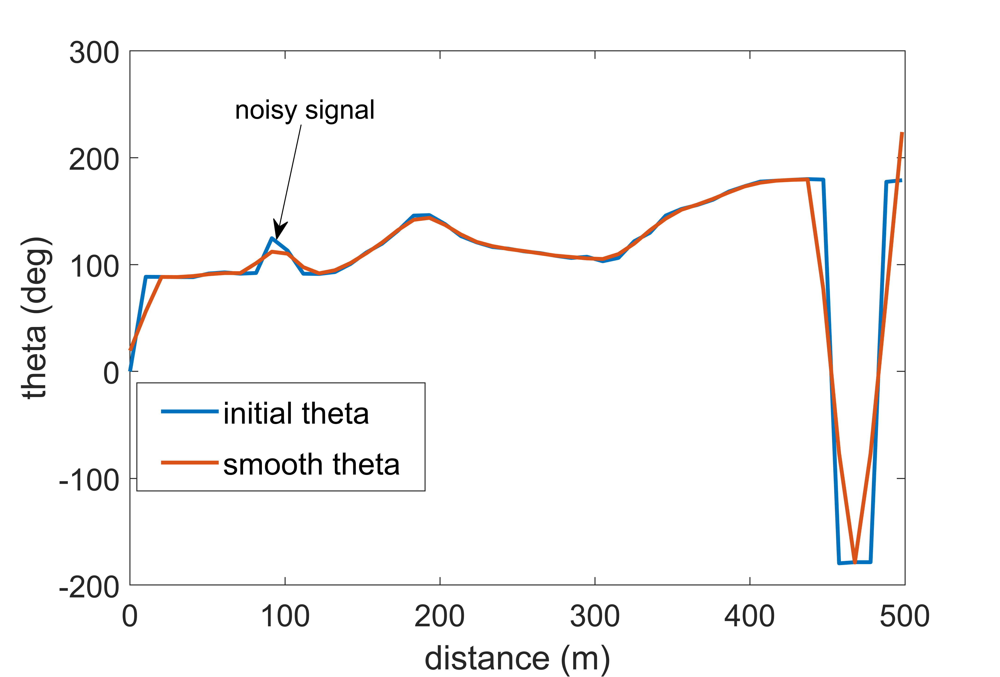
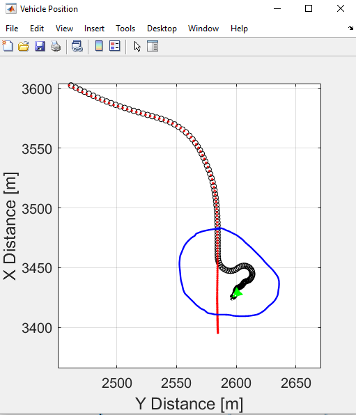
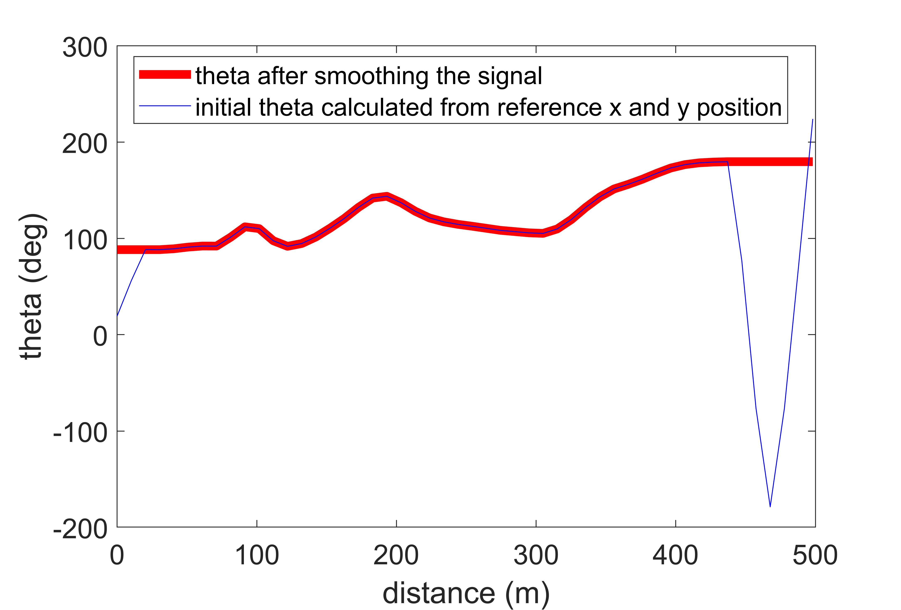
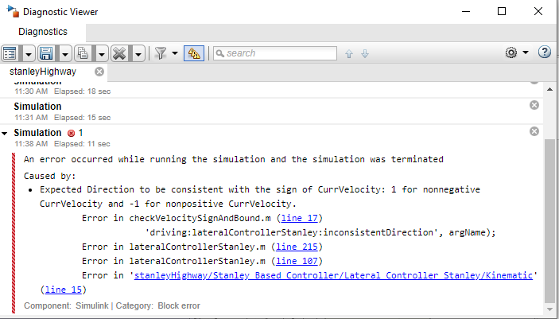

# Vehicle Path Tracking Using Stanley Controller

The submission contains a model to show the implementation of Stanley controller on a vehicle moving in a US Highway scene. Steps below describe the workflow:
1. Generating waypoints
2. Smoothing vehicle reference position and orientation
3. Generating velocity profile
4. Implementing Stanley controller 
5. Visualizing vehicle final path in 2D, Bird's-Eye Scope, and a 3D simulation environment. 

The users can refer to this model to perform path tracking applications for given waypoints. The results can be visualized in a 2D plot that compares the obtained and the reference trajectory.

## Model

### stanleyHighway.slx
The model implements a Stanley controller to drive the vehicle through the US Highway scene.
## Supporting files and folders (Before running the model, please make sure all these files are in the current folder)
### Images
The folder contains images for masking certain blocks in the model
### setUpModel.m
The file initializes the parameters required to run the model
### USHighway.mat
The file contains data for the US Highway scene
### velocityProfile.mlx
The live script generates velocity profile based on trapezoidal profile
## Product Requirements

The models are developed in MATLAB R2020b version and use the following MathWorks products:
1. Automated Driving Toolbox
2. Curve Fitting Toolbox
3. MATLAB
4. Simulink
5. Simulink Coder
6. Statistics and Machine Learning Toolbox
7. Vehicle Dynamics Blockset
8. DSP System Toolbox
9. Signal Processing Toolbox
10. ROS Toolbox

## About the model
The model shows the implementation of Stanley controller on a vehicle moving in a US Highway scene:
- It comprises of a vehicle dynamics model based on a 3 DOF rigid two-axle vehicle body and a simplified powertrain and driveline. The vehicle dynamics model has been taken from one of the reference applications titled, [Scene Interrogation with Camera and Ray Tracing Reference Application](https://www.mathworks.com/help/vdynblks/ug/scene-interrogation-reference-application.html). For more detailed vehicle dynamics models, please check out the [Vehicle Reference Applications](https://www.mathworks.com/help/vdynblks/examples.html?category=index&s_tid=CRUX_topnav).
- The model uses a trapezoidal velocity profile to generate the reference velocity
- The mat file contains the waypoints for the US Highway scene exported from the Driving Scenario Designer
- The Stanley controller outputs steering, acceleration, and deceleration commands to track the reference trajectory
- The model displays the vehicle motion in the 2D plot, 3D Unreal Engine US highway scene, and in Bird's-Eye Scope  

## How to run the model?

Open and run the stanleyHighway.slx model. The model automatically loads the setUpModel.m and velocityProfile.mlx files that initializes the vehicle parameters and reference velocity profile required to run the model. 

## How to use the model?

Please note that the model has been tuned for a given set of waypoints and a velocity map. In case, you wish to customize it for a different test case, here are the steps to be followed:
1. **Define a waypoint vector:** The waypoint is generated using the Driving Scenario Designer. For the current US Highway scene, the project has been saved as USHighway.mat file. If you want the vehicle to follow a different trajectory, use the Driving Scenario Designer to define the waypoints and save it as a mt file. In case, you already have the waypoints, make sure to call the x and y coordinates using the “setUpModel” script.
2. **Interpolate and smooth the reference position and orientation:** Note that one of the important steps while implementing the Stanley controller is to prepare the reference position and orientation. The waypoint vector sample points may not be appropriate to generate a smooth path. Hence, it is recommended to interpolate and remove the noise from the reference position and orientation. Please refer to the “Troubleshooting” section to understand the significance of interpolating and smoothing the reference signal.
3. **Define a reference velocity profile:** The live script “velocityProfile.mlx” generates the reference velocity based on the following methods
- Basic trapezoidal profile
- Radius of curvature and friction based trapezoidal profile
- Maximum velocity and acceleration based trapezoidal profile
Please check out the live script for more details.

4. **Tune the controller:** Please note that the performance of the Stanley controller depends upon various tuning parameters. Please go through the documentation of the [Longitudinal Controller Stanley](https://www.mathworks.com/help/driving/ref/longitudinalcontrollerstanley.html) and [Lateral Controller Stanley](https://www.mathworks.com/help/driving/ref/lateralcontrollerstanley.html) blocks to learn more about the selection of these parameters.  

## Troubleshooting the model
This section covers a few troubleshooting tips which you may encounter while modifying the model for a different set of reference waypoints and vehicle parameters:
1. **Signal smoothing:** The figure shows the reference theta (vehicle orientation angle) obtained from the vehicle reference waypoints

As can be seen, theta in certain instances is noisy. This can lead to the deviation of the vehicle path from the reference path. Hence, it is recommended to remove the noise by smoothing the signal. We have used the built-in “smooth” function to remove the noise.

2. **Removal of abrupt changes in vehicle orientation angle:** Suppose you have interpolated and removed the noise from the reference theta and the vehicle still deviates from the path.

The reason is when we use atan2 to calculate theta and when theta is approximately >= |180| deg, there will be continuous fluctuations. Hence, it is important to remove these abrupt changes. We have used the built-in “findchangepts” to find the abrupt changes and have implemented a simple logic to replace this signal from the previous smooth signal. 

Please note it's a manual process. So, it's recommended to visualize the data and tune the changepoints and regions to remove the abrupt changes from the signal.

Important note: If there is no fluctuation in theta for -180<theta<=180, consider removing this section and use thetaRefs as input to the Simulink model lookup table block named, "Theta Ref."

3. **Running model at a higher velocity:** Suppose you want the vehicle to reach a maximum velocity of 30 m/s. So for that, you will need to open the “velocityProfile” script and will need to input 30 m/s as the maximum velocity. Once you run the simulation you will encounter the following error:

One possible reason is at the turn the vehicle is at very high velocity. Hence, if we lower the velocity at the turn by increasing the “number of sharp turns” input in the “velocityProfile” script to 2, the model will run successfully. 

So, the above tips and tricks would help you tune your model. In case of any queries, please reach out to us at racinglounge@mathworks.com. 

Copyright 2021 The MathWorks, Inc.

